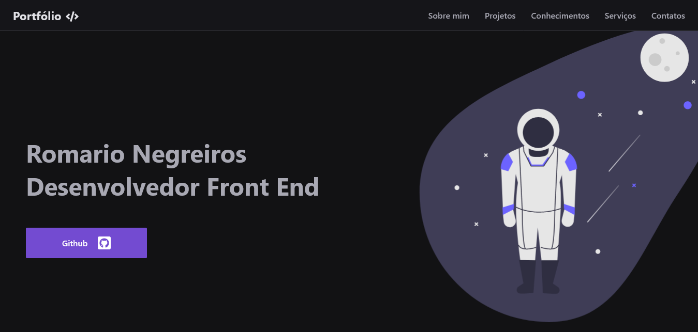

  

     
     <h2>
        Romario Negreiros Baldarenas da Silva  
        Desenvolvedor de Software
     </h2>
  

  

    <h3>Bem vindo ao meu portfólio ✌
  

  

    

      Aqui você vai encontrar um pouco sobre mim, sobre como eu escolhi essa área,
      assim como o que eu aprendi ao longo dos meus estudos e os projetos que eu
      construi para práticar.
    

  

  

  

      

        <h4>Preview do inicio do site</h3>
        
      

      

      

        <h4>Métricas do lighthouse</h3>
        
      

   

